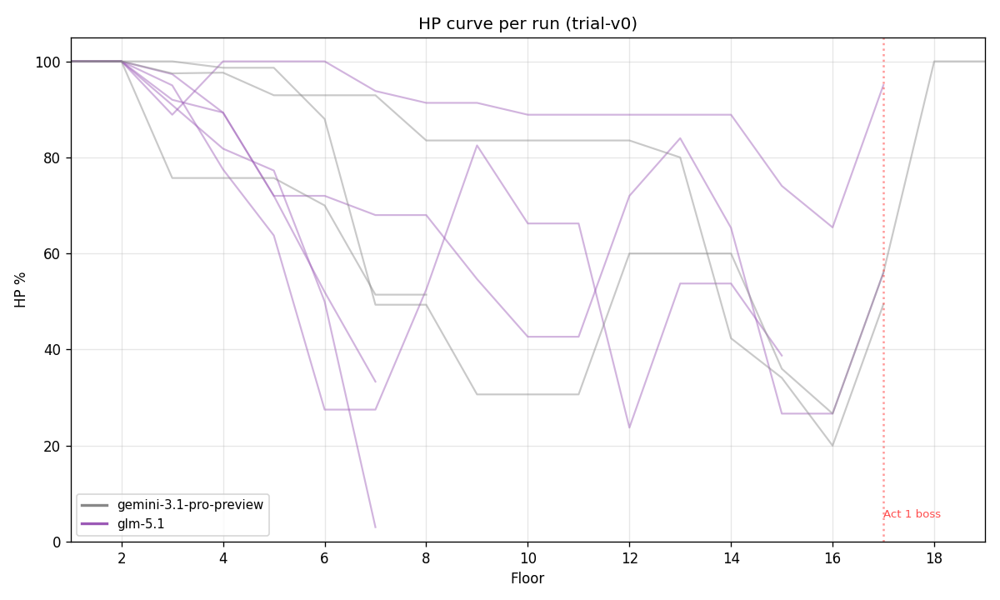
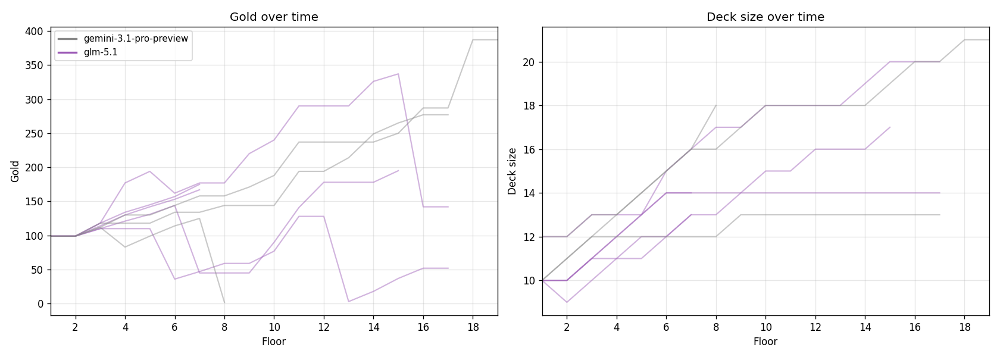
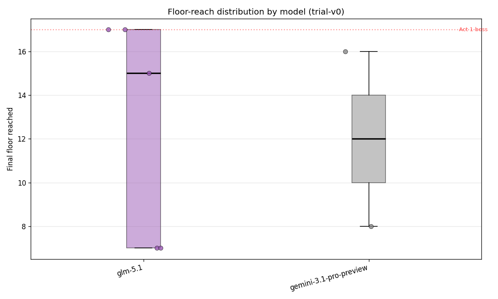
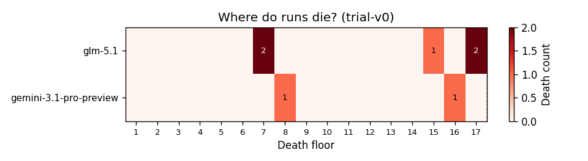
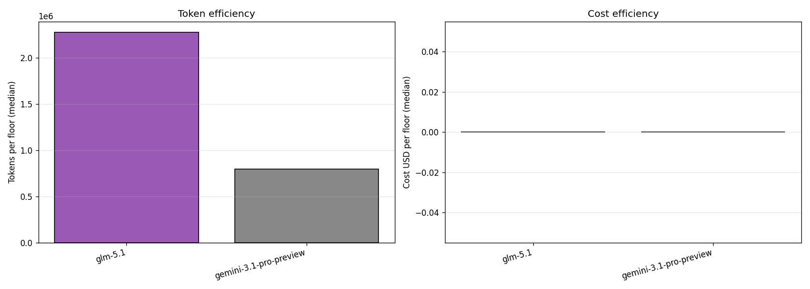
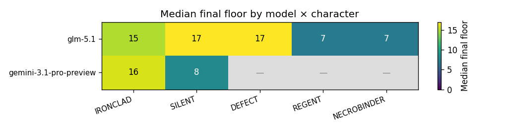

# SpireBench trial-v0.1 — Trial Summary

_Auto-generated by `tools/spirebench-summary.py`. Do not edit by hand —
re-run the script after appending new runs to `runs.csv`._

## Overview

- Total runs: **8** (with run records: 8)
- Halt reasons: death=7, stall=1
- Models tested: gemini-3.1-pro-preview, glm-5.1
- Characters: DEFECT, IRONCLAD, NECROBINDER, REGENT, SILENT

## Per-model results

| model | runs | victories | deaths | rate_limits | median_floor | max_floor | mean_tokens_total | mean_cost_usd | mean_wall_seconds |
| --- | --- | --- | --- | --- | --- | --- | --- | --- | --- |
| glm-5.1 | 5 | 0 | 5 | 0 | 15.00 | 17.00 | 31671320 | 0.00 | 6181 |
| gemini-3.1-pro-preview | 3 | 0 | 2 | 0 | 12.00 | 16.00 | 19031863 | 0.00 | 3644 |

## Per-character results

| character | runs | victories | median_floor | max_floor |
| --- | --- | --- | --- | --- |
| IRONCLAD | 2 | 0 | 15.50 | 16.00 |
| SILENT | 2 | 0 | 12.50 | 17.00 |
| DEFECT | 1 | 0 | 17.00 | 17.00 |
| REGENT | 2 | 0 | 7.00 | 7.00 |
| NECROBINDER | 1 | 0 | 7.00 | 7.00 |

## Charts

### HP curve overlay

### Gold and deck-size growth

### Floor-reach distribution

### Death-floor heatmap

### Tokens and cost per floor

### Character difficulty matrix

